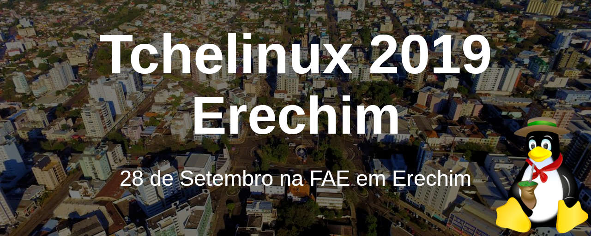
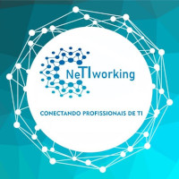

## Sobre

O grupo de usuários de Software Livre Tchelinux, em parceria com a [**Faculdade Anglicana de Erechim**](http://www.legiaodacruz.com.br/), tem o prazer de convidar a comunidade para participar do evento que ocorrerá no dia **28 de Setembro de 2019 a partir das 8:30h** na FAE em Erechim.

## Inscrições

As inscrições estarão abertas a partir do dia 12 de Agosto, quando a **programação do evento** for anunciada.

O evento tem **entrada franca**, porém os participantes são encorajados a doar 2kg de alimentos não perecíveis (exceto sal), que são doados a instituições de caridade da região.

**Importante:** Os alimentos são recebidos no momento do credenciamento.

## Certificados

Serão fornecidos certificados digitais para os participantes do evento, que confirmaram sua presença. Para obtê-los, você deverá utilizar o email fornecido na sua inscrição para o evento.

**Importante:** Não esqueça de confirmar sua presença no credenciamento.

<a href="https://erechim.tchelinux.org/inscricoes/" style="color:#ff4040"><b>Clique aqui e faça sua inscrição!</b></a>

## Programação

| 
 Horário 
 | 
 Sala 1 
 | 
 Sala 2 
 | 
 Sala 3 
 |
|:--------------------------:|:-----------------------:|:-----------------------:|:-----------------------:|
| **08:30** <td colspan=3>
**Credenciamento**
 |
| **09:00** <td colspan=3>
**Abertura**  Todo o público  Equipe Tchelinux  
 |
| **09:30** <td colspan=3>
[**Porque e Como Participar de Projetos Open Source**](#Porque_e_Como_Participar_de_Projetos_Open_Source)  Principiante  Julio Biason  
 |
| **10:20** <td colspan=3>
[**Software Livre em Ambientes Empresariais**](#Software_Livre_em_Ambientes_Empresariais)   Principiante   Marcos Lucas |
| **11:10** <td colspan=3>
[**Linux, Raspberry Pi e IoT**](#Linux,_Raspberry_Pi_e_IoT)   Intermediário   Ricardo da Silva Ogliari |
| **12:00** <td colspan=3>
**Intervalo para Almoço**
 |
| **13:30** | [**Porque Você Deve Aprender Rust **](#Porque_Você_Deve_Aprender_Rust)   Principiante   Julio Biason | [**Mulheres, Tecnologia e Sororidade**](#Mulheres,_Tecnologia_e_Sororidade)   Principiante   Leonara Lorini, Patrícia Tussi, Pollyanna Rigon Valente e Tatiana Cavalheri Borges Dias | [**Cases Empresariais**](#Cases_Empresariais)   Principiante   Cases Empresariais sobre Software Livre  |
| **14:20** | [**Por que a galinha atravessou a rua?**](#Por_que_a_galinha_atravessou_a_rua?)   Principiante   Alan Mussoi |  [**Escrevendo um livro sobre Software Livre**](#Escrevendo_um_livro_sobre_Software_Livre)   Principiante   Ricardo da Silva Ogliari |  [**Cases Empresariais**](#Cases_Empresariais)   Principiante   Cases Empresariais sobre Software Livre   |
| **15:10** <td colspan=3>
**Coffee-Break**
 |
| **15:40** | [**Flask and you**](#Flask_and_you)   Intermediário   Luciano Camargo Cruz  | [**O Maravilhoso Mundo das Competições Capture the Flag (CTF)**](#O_Maravilhoso_Mundo_das_Competições_Capture_the_Flag)   Principiante   Álisson Bertochi   | [**Cases Empresariais**](#Cases_Empresariais)   Principiante   Cases Empresariais sobre Software Livre   |
| **16:30** | [**Pentaho, garantindo o sucesso do BI**](#Pentaho,_garantindo_o_sucesso_do_BI)   Avançado   Tatiana Cavalheri Borges Dias   | [**Flutter e IoT**](#Flutter_e_IoT)   Intermediário   Ricardo da Silva Ogliari  | [**Cases Empresariais**](#Cases_Empresariais)   Principiante   Cases Empresariais sobre Software Livre    |
| **17:20** <td colspan=3>
**Encerramento**  Todo o público     Equipe Tchelinux    
 |

## Palestras

### Porque e Como Participar de Projetos Open Source

No mundo atual, todos usam pelo menos um aplicativo open source. Mas como participar disso? Como ajudar o aplicativo a melhorar? É preciso saber programar para ajudar? Essas e outras perguntas serão respondidas nessa apresentação.

### Julio Biason

[Julio Biason](https://functional.cafe/@juliobiason) participa de projetos open source desde 1990.

### Software Livre em Ambientes Empresariais

Nesta palestra falaremos sobre soluções de tecnologia em Software Livre aplicado a empresas e serão mencionadas as principais vantagens e desvantagens. Serão dadas dicas de como utilizar Software Livre em três cenários diferentes: para empresas que não são de tecnologia mas necessitam de soluções tecnológicas; para empresas que são de tecnologia e precisam desenvolver novas soluções; e para profissionais que possuem a dúvida recorrente de "como ganhar dinheiro com software livre". Nesta conversa aberta, estes temas serão debatidos tendo em mente o mercado regional e a realidade das empresas do Alto Uruguai e norte gaúcho.

### Marcos Lucas

[Marcos Lucas](https://twitter.com/MarcosLucas) é Professor Universitário nos cursos de Ciência da Computação (URI) e Análise e Desenvolvimento de Sistemas (FAE). Gestor da empresa DATAWARE, pela qual é responsável pela infraestrutura de tecnologia de rede, servidores e nuvem de diversas empresas da região do Alto Uruguai. Pós-graduado em Redes de Computadores e Mestre em Computação Aplicada (UPF) trabalhando com soluções embarcadas aplicadas ao campo de Engenharia Biomédica. Entusiasta de software livre, trabalhando com este de maneira profissional há quase duas décadas, tendo já contribuído em eventos da área.

### Linux, Raspberry Pi e IoT 

O Objetivo da palestra é mostrar como é fácil instalar e configurar um sistema operacional Linux em um mini-PC Raspberry Pi. Além disso, irei analisar a API para integrar com Internet das Coisas, demonstrações que é possível ser feito.

### Ricardo da Silva Ogliari

[Ricardo da Silva Ogliari](https://github.com/ricardoogliari) é bacharel em Ciência da Computação pela Universidade de Passo Fundo, especialista em Web: Estratégias de Inovação e Tecnologia pelo Senac SP e MBA em Desenvolvimento de Jogos e Aplicativos Móveis pela FIAP. Desenvolvedor mobile há mais de uma década. Professor em cursos de pós-graduação em instituições de ensino como Universidade de Passo Fundo, Senac e Faculdade de Pato Branco. Coautor do livro Android: do Básico ao Avançado. Autor do livro IoT para Desenvolvedores. Palestrante em eventos nacionais e internacionais, como FISL, TDC, Campus Party, QCon e RubyConf. Autor de artigos para revistas nacionais como iMasters e Mobile Magazine.

### Porque Você Deve Aprender Rust

Rust (a linguagem, não o jogo) é uma linguagem que produz código em que a memória é protegida. Trazendo muitas das funcionalidades de linguagens funcionais, com abstrações de alto nível e performance semelhante a C, Rust é uma linguagem que você realmente deve aprender.

### Julio Biason

[Julio Biason](https://functional.cafe/@juliobiason) é programador desde os 12 anos e já conheceu várias linguagens, mas nenhuma que fosse tão interessante quanto Rust.

### Mulheres, Tecnologia e Sororidade 

Pretendemos destacar as mulheres referências da história da TI, o que fizeram e qual legado deixaram. Bem como as possibilidades no mercado de trabalho feminino em âmbito nacional e regional, mostrando o leque de opções e o quanto as mulheres podem crescer e fazer a diferença na tecnologia. Apresentaremos também uma pesquisa sobre a inclusão das mulheres no ensino superior de TI em Erechim, destacando alguns dos motivos que levam a desigualdade de números entre homens e mulheres e como as instituições estão lidando com isso. Destacaremos o conceito de sororidade e com ele as comunidades existentes de TI para mulheres, detalhando as comunidades de software livre Pyladies e Django girls. E finalizaremos com uma pesquisa dos softwares livres que são mais utilizados pelas mulheres que participarem do grupo de mulheres da TI de Erechim no Whatsapp.

Somos representantes de um grupo de mulheres unidas em busca de conhecimento e da igualdade de gênero na área de TI:

### Leonara Lorini

[Leonara Lorini](https://www.linkedin.com/in/leonara-lorini-770108b1) é Formada em Ciência da Computação (URI), com Especialização em Segurança da Informação (SENAC) - Atua com suporte, banco de dados e desenvolvimento interno na Edelbra Gráfica LTDA.

### Patrícia Tussi

[Patrícia Tussi](https://linkedin.com/in/patricia-tussi-4961912a) é Formada em Ciência da Computação pela Universidade Regional Integrada Erechim. Pós-graduada em Gerência de Projetos em TI pela UNISUL. Experiência de 19 anos em TI nas áreas de análise de sistemas e programação, programação de ERP para Universidades, gerenciamento de projetos, implantação e manutenção de sistemas.

### Pollyanna Rigon Valente

[Pollyanna Rigon Valente](https://br.linkedin.com/in/pollyannarigon) é Formada em Ciência da Computação (URI) e atua como Programador de Software Jr na Compasso. Profissional da área de Telecomunicações e buscando especialização em Governança da Internet. Membro do Capitulo Brasileiro da Internet Society (ISOC), SIG YOUTH e SIG WOMEN. Entusiasta do Software Livre e evangelista IPv6.

### Tatiana Cavalheri Borges Dias

[Tatiana Cavalheri Borges Dias](https://www.linkedin.com/in/tatianacavalheriborgesdias/) é Graduada em Web Design e Programação pela UNISUL e Gestão da Tecnologia da Informação pela UNIP. Pós graduada em Gerenciamento de Projetos pela Barão de Mauá e Business Intelligence pelo IGTI. Carreira desenvolvida ao longo de 24 anos na área de Tecnologia da Informação, com experiência em gerenciamento de projetos, implantação e manutenção de sistemas, gestão de equipes, planejamento estratégico, construção de parcerias internas e na interface entre a área de Negócios e TI, otimizando a comunicação, atendimento às necessidades e garantindo a obtenção de resultados.

Especialista em Business Intelligence, análise e estruturação de dados para Data Warehouse, criação de dashboards utilizando Pentaho, PowerBI e Tableau. 

Atualmente trabalha como Coordenadora de TI e Projetos na Reitoria da Universidade Regional Integrada - URI, em Erechim.

### Por que a galinha atravessou a rua?

Nessa palestra desenvolveremos um ambiente semelhante ao clássico jogo Freeway, do Atari2600 (onde objetivo do jogador é levar uma galinha até o outro lado de uma movimentada rodovia), e aplicaremos um algoritmo de inteligência artificial para que nossas galinhas aprendam sozinhas a atravessar a rua. Ao final da palestra os espectadores terão aprendido conceitos básicos da biblioteca pygame, de inteligência artificial, e principalmente, saberão a resposta para a pergunta que dá título à palestra.

### Alan Mussoi

[Alan Mussoi](https://www.linkedin.com/in/alanmussoi/) é Analista de Sistemas e estudante de Matemática Computacional. Entusiasta de Ciência e Tecnologia. Possui grande interesse por assuntos relacionados a modelos matemáticos, simuladores e inteligência artificial.

### Escrevendo um livro sobre Software Livre 

A palestra é dividida em duas partes. A primeira delas eu conto como é o processo de produção do livro. As dores e as glórias que existem, no meu entendimento. Tento levar pro lado motivacional, levantando pontos como escrita de artigos, palestras em eventos e dinheiro social. Na segunda parte da palestra falo sobre os capítulos do meu livro e, em dois deles em especial, faço uma pequena demonstração.

### Ricardo da Silva Ogliari

[Ricardo da Silva Ogliari](https://github.com/ricardoogliari) é bacharel em Ciência da Computação pela Universidade de Passo Fundo, especialista em Web: Estratégias de Inovação e Tecnologia pelo Senac SP e MBA em Desenvolvimento de Jogos e Aplicativos Móveis pela FIAP. Desenvolvedor mobile há mais de uma década. Professor em cursos de pós-graduação em instituições de ensino como Universidade de Passo Fundo, Senac e Faculdade de Pato Branco. Coautor do livro Android: do Básico ao Avançado. Autor do livro IoT para Desenvolvedores. Palestrante em eventos nacionais e internacionais, como FISL, TDC, Campus Party, QCon e RubyConf. Autor de artigos para revistas nacionais como iMasters e Mobile Magazine.

### Flask and you 

A ideia é apresentar o Flask de maneira geral, suas possíveis aplicações. Utilizando um exemplo prático.

### Luciano Camargo Cruz

[Luciano Camargo Cruz](https://br.linkedin.com/in/luciano-camargo-cruz) atua como Software Developer, DevOps e Team Leader na Contentools. Possuí formação em Gestão Estratégica de Tecnologia da Informação pela IMED e Bacharel em Ciência da Computação pela Universidade de Caxias do Sul. Trabalha com software livre a mais de 15 anos. É membro da Associação Python Brasil (APyB) e Plone Foundation.

### O Maravilhoso Mundo das Competições Capture the Flag

Serão apresentadas as competições de Segurança da Informação no formato Capture the Flag (CTF), bem como a comunidade do Projeto CTF-BR.

### Álisson Bertochi 

[Álisson Bertochi](https://twitter.com/alissonbertochi) é idealizador do Projeto CTF-BR, Capitão do Epic Leet Team (ELT), melhor time de CTF da América Latina nos últimos anos e time que comprometeu as Urnas Eletrônicas durante o TPS (Teste Público de Segurança do Sistema Eletrônico de Votação) realizado pelo TSE em 2017.

### Pentaho, garantindo o sucesso do BI 

Todo projeto de BI possui um processo muito importante que vale muito a pena ser falado o ETL (Extrair, Transformar e Carregar). Este processo é responsável por 80% do esforço em projetos de BI. Para solucionar problemas como este pode-se usar a ferramenta Pentaho Data Integration.  Sendo assim vou falar um pouco sobre esta ferramenta e como a mesma pode contribuir com a resolução de problemas como tempo de processamento, esforço de desenvolvimento e  aumento de valor agregado do projeto.

### Tatiana Cavalheri Borges Dias 

[Tatiana Cavalheri Borges Dias](https://www.linkedin.com/in/tatianacavalheriborgesdias/) é Graduada em Web Design e Programação pela UNISUL e Gestão da Tecnologia da Informação pela UNIP. Pós graduada em Gerenciamento de Projetos pela Barão de Mauá e Business Intelligence pelo IGTI. Carreira desenvolvida ao longo de 24 ano, na área de Tecnologia da Informação, com experiência em gerenciamento de projetos, implantação e manutenção de sistemas, gestão de equipes, planejamento estratégico, construção de parcerias internas e na interface entre a área de Negócios e TI, otimizando a comunicação, atendimento às necessidades e garantindo a obtenção de resultados.

Especialista em Business Intelligence, análise e estruturação de dados para Data Warehouse, criação de dashboards utilizando Pentaho, PowerBI e Tableau. 

Atualmente trabalha como Coordenadora de TI e Projetos na Reitoria da Universidade Regional Integrada - URI, em Erechim.

### Flutter e IoT 

Sou um desenvolvedor com a base em programação nativa para Android. Recentemente passei a estudar a plataforma Flutter. Além disso, sou um apaixonado pelo mundo IoT. Como já tinha feito alguns testes envolvendo Android nativo e IoT, decidi estudar como faria essa portabilidade das soluções criadas para Flutter. E esta palestra visa mostrar o resultado destes estudos.

### Ricardo da Silva Ogliari

[Ricardo da Silva Ogliari](https://github.com/ricardoogliari) é bacharel em Ciência da Computação pela Universidade de Passo Fundo, especialista em Web: Estratégias de Inovação e Tecnologia pelo Senac SP e MBA em Desenvolvimento de Jogos e Aplicativos Móveis pela FIAP. Desenvolvedor mobile há mais de uma década. Professor em cursos de pós-graduação em instituições de ensino como Universidade de Passo Fundo, Senac e Faculdade de Pato Branco. Coautor do livro Android: do Básico ao Avançado. Autor do livro IoT para Desenvolvedores. Palestrante em eventos nacionais e internacionais, como FISL, TDC, Campus Party, QCon e RubyConf. Autor de artigos para revistas nacionais como iMasters e Mobile Magazine.

### Cases Empresariais 

Espaço dedicado a apresentação de cases empresariais utilizando Software Livre na Região do Alto-Uruguai.

## Local

> **Faculdade Anglicana de Erechim**
> Av. Sete de Setembro, 44
> Erechim, RS

    <iframe src="https://www.google.com/maps/embed?pb=!1m18!1m12!1m3!1d3534.643884782674!2d-52.27540998391807!3d-27.63554388282176!2m3!1f0!2f0!3f0!3m2!1i1024!2i768!4f13.1!3m3!1m2!1s0x94e3138b0361e36f%3A0xbdc4dd1e19bdd049!2sAv.+Sete+de+Setembro%2C+44+-+Centro%2C+Erechim+-+RS%2C+99700-000%2C+Brazil!5e0!3m2!1sen!2sus!4v1563075088795!5m2!1sen!2sus" width="600" height="480" frameborder="0" style="border:0" allowfullscreen></iframe>

## Apoio

### Institucional

### Patrocínio

### Divulgação

